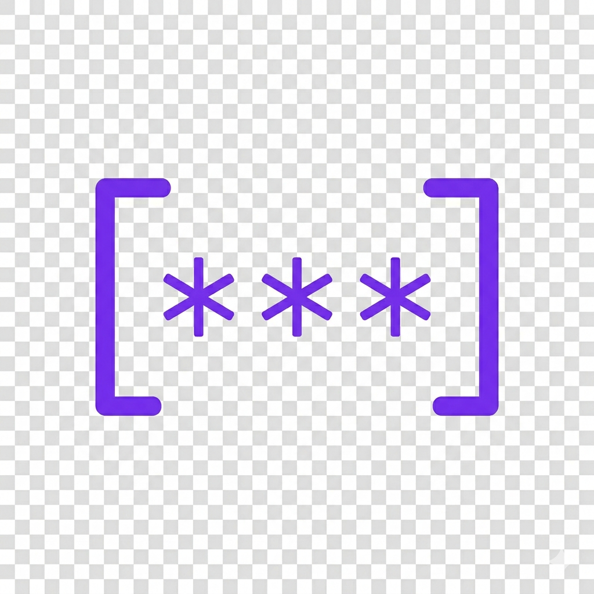

<p align="center">
  
</p>

<h1 align="center">Moongazing.Veil</h1>

<p align="center">
  <strong>Sensitive Data Masking & PII-Safe Logging for .NET</strong><br />
  <em>Sensitive data never leaks. Not in logs, not in responses, not anywhere.</em>
</p>

<p align="center">
  <a href="https://www.nuget.org/packages/Moongazing.Veil"></a>
  <a href="https://www.nuget.org/packages/Moongazing.Veil"></a>
  
  <a href="https://github.com/tunahanaliozturk/Moongazing.Veil/blob/main/LICENSE"></a>
  <a href="https://github.com/tunahanaliozturk/Moongazing.Veil/actions"></a>
</p>

---

## Features

- **Automatic PII Detection** -- Detects and masks emails, phone numbers, credit cards, IBANs, Turkish IDs, JWT tokens, API keys, and IP addresses out of the box.
- **String-Level Masking** -- Mask individual values with `Veil.Mask()` or redact all sensitive data in a block of text with `Veil.Redact()`.
- **Object-Level Masking** -- Mark properties with the `[Veiled]` attribute or use convention-based rules. Original objects are never mutated.
- **HTTP Middleware** -- Automatically redact headers, query strings, and JSON bodies in ASP.NET Core request/response logs.
- **Serilog Integration** -- Destructuring policy and enricher that make every log statement PII-safe without changing a single log call.
- **Locale Support** -- Region-specific patterns for Turkey, Italy, and the EU.
- **Custom Patterns** -- Define your own regex-based patterns with full control over the masking strategy.
- **Compliance Ready** -- Designed to help meet GDPR, KVKK, and PCI-DSS requirements.

---

## Packages

| Package | Description | NuGet |
|---|---|---|
| **Moongazing.Veil** | Core library -- string masking, object masking, detection, patterns | [](https://www.nuget.org/packages/Moongazing.Veil) |
| **Moongazing.Veil.AspNetCore** | ASP.NET Core HTTP middleware for request/response redaction | [](https://www.nuget.org/packages/Moongazing.Veil.AspNetCore) |
| **Moongazing.Veil.Serilog** | Serilog integration -- destructuring policy and enricher | [](https://www.nuget.org/packages/Moongazing.Veil.Serilog) |

---

## Quick Start

### Installation

```bash
# Core library
dotnet add package Moongazing.Veil

# ASP.NET Core middleware (optional)
dotnet add package Moongazing.Veil.AspNetCore

# Serilog integration (optional)
dotnet add package Moongazing.Veil.Serilog
```

### Register Services

```csharp
// Program.cs
builder.Services.AddVeil();
```

---

## Usage

### String Masking

Use `Veil.Mask()` to mask a single sensitive value. Veil automatically detects the data type and applies the appropriate pattern.

```csharp
string masked;

masked = Veil.Mask("john.doe@gmail.com");
// "j******e@g****.com"

masked = Veil.Mask("+905551234567");
// "+90555***4567"

masked = Veil.Mask("5425 1234 5678 9012");
// "5425 **** **** 9012"

masked = Veil.Mask("TR33 0006 1005 1978 6457 8413 26");
// "TR33 **** **** **** **13 26"

masked = Veil.Mask("12345678901");  // Turkish ID
// "123*****901"

masked = Veil.Mask("Bearer eyJhbGciOiJIUzI1NiIs...");
// "Bearer eyJh***..."
```

Use `Veil.Redact()` to scan an entire text block and mask every piece of sensitive data found.

```csharp
string logMessage = "User john@test.com paid with card 5425123456789012";
string safe = Veil.Redact(logMessage);
// "User j***@t***.com paid with card 5425 **** **** 9012"
```

### Extension Methods

```csharp
// String extensions
string safe = "john@test.com".Veil();
// "j***@t***.com"

string safe = "Some text with john@test.com in it".RedactAll();
// "Some text with j***@t***.com in it"

// Object extensions
UserDto masked = user.VeilProperties();
```

### Object Masking with the `[Veiled]` Attribute

Mark properties that contain sensitive data. `Veil.MaskObject()` returns a new instance with those properties masked -- the original object is never modified.

```csharp
public class UserDto
{
    public string Name { get; set; }

    [Veiled]
    public string Email { get; set; }

    [Veiled(VeilPattern.CreditCard)]
    public string CardNumber { get; set; }

    [Veiled(VeilPattern.Phone)]
    public string Phone { get; set; }

    [Veiled(Show = 0)]  // Mask everything
    public string Password { get; set; }

    [Veiled(Show = 4, Position = VeilPosition.Last)]
    public string AccountNumber { get; set; }
}

UserDto user = GetUser();
UserDto masked = Veil.MaskObject(user);
// masked.Email       -> "j***@g***.com"
// masked.CardNumber  -> "5425 **** **** 9012"
// masked.Password    -> "********"
```

### Convention-Based Masking (No Attributes)

Define global rules based on property names. No changes to your DTOs required.

```csharp
services.AddVeil(options =>
{
    options.Convention(conv =>
    {
        conv.WhenPropertyName(name => name.Contains("Email", StringComparison.OrdinalIgnoreCase))
            .UsePattern(VeilPattern.Email);

        conv.WhenPropertyName(name => name.Contains("Phone") || name.Contains("Gsm"))
            .UsePattern(VeilPattern.Phone);

        conv.WhenPropertyName(name => name.Contains("CardNumber") || name.Contains("CreditCard"))
            .UsePattern(VeilPattern.CreditCard);

        conv.WhenPropertyName(name => name.Contains("Password") || name.Contains("Secret"))
            .UsePattern(VeilPattern.Full);

        conv.WhenPropertyName(name => name.Contains("Token") || name.Contains("ApiKey"))
            .UsePattern(VeilPattern.Token);

        conv.WhenPropertyName(name => name.Contains("Iban"))
            .UsePattern(VeilPattern.Iban);
    });
});

// Now any object is masked automatically by convention
UserDto masked = Veil.MaskObject(user);
```

### HTTP Middleware (Moongazing.Veil.AspNetCore)

Intercept and redact sensitive data in HTTP traffic before it reaches your logs.

```csharp
services.AddVeil(options =>
{
    options.Http(http =>
    {
        http.LogRequests = true;
        http.LogResponses = true;
        http.MaxBodyLength = 4096;

        // Header redaction
        http.RedactHeaders("Authorization", "X-Api-Key", "Cookie", "Set-Cookie");

        // JSON body field redaction
        http.RedactBodyFields("$.password", "$.creditCard", "$.ssn", "$.token");

        // Query string redaction
        http.RedactQueryParams("api_key", "token", "secret");

        // Conditional redaction
        http.RedactWhen(context =>
            context.Request.Path.StartsWithSegments("/api/payments"));
    });
});

app.UseVeilRedaction();
```

Log output becomes PII-safe automatically:

```
[INF] POST /api/users -> 201 | Body: {"email":"j***@g***.com","password":"********"}
[INF] GET /api/orders?api_key=*** -> 200
[INF] Authorization: Bearer eyJh***...
```

### Serilog Integration (Moongazing.Veil.Serilog)

Add Veil to your Serilog pipeline. Structured log properties and message templates are both redacted.

```csharp
Log.Logger = new LoggerConfiguration()
    .Destructure.WithVeil()        // Auto-mask during object destructuring
    .Enrich.WithVeilRedaction()    // Redact sensitive data in message templates
    .CreateLogger();
```

Then log as usual -- Veil handles the rest:

```csharp
Log.Information("User {User} logged in from {Email}", user, user.Email);
// Output: User { Name: "John", Email: "j***@g***.com" } logged in from j***@g***.com

Log.Error(ex, "Payment failed for card {CardNumber}", cardNumber);
// Output: Payment failed for card 5425 **** **** 9012
```

### Custom Patterns

Register your own patterns with a regex and a masking strategy.

```csharp
services.AddVeil(options =>
{
    options.AddPattern("TurkishId", new VeilPatternDefinition
    {
        Regex = @"\b[1-9]\d{10}\b",
        MaskStrategy = (value) =>
        {
            return $"{value[..3]}*****{value[^3..]}";
        },
        Description = "Turkish National ID"
    });
});
```

### Locale Support

Enable region-specific patterns with a single call.

```csharp
services.AddVeil(options =>
{
    options.AddLocale(VeilLocale.Turkey);  // TC Kimlik, Vergi No, IBAN TR
    options.AddLocale(VeilLocale.Italy);   // Codice Fiscale, Partita IVA, IBAN IT
    options.AddLocale(VeilLocale.EU);      // GDPR-aware patterns
});
```

---

## Built-in Patterns

| Pattern | Example Input | Masked Output |
|---|---|---|
| `Email` | `john.doe@gmail.com` | `j******e@g****.com` |
| `Phone` | `+905551234567` | `+90555***4567` |
| `CreditCard` | `5425 1234 5678 9012` | `5425 **** **** 9012` |
| `Iban` | `TR33 0006 1005 1978 6457 8413 26` | `TR33 **** **** **** **13 26` |
| `TurkishId` | `12345678901` | `123*****901` |
| `Token` | `Bearer eyJhbGciOiJIUzI1NiIs...` | `Bearer eyJh***...` |
| `ApiKey` | `sk-abc123def456ghi789` | `sk-abc***789` |
| `Ipv4` | `192.168.1.100` | `192.168.*.*` |
| `Full` | `mysecretpassword` | `****************` |
| `Custom` | _(user defined)_ | _(user defined)_ |

---

## Configuration

All settings are exposed through `VeilOptions` when registering the service.

```csharp
services.AddVeil(options =>
{
    // Change the mask character (default: '*')
    options.DefaultMaskChar = '#';

    // Add conventions for attribute-free masking
    options.Convention(conv => { /* ... */ });

    // Configure HTTP redaction
    options.Http(http => { /* ... */ });

    // Register custom patterns
    options.AddPattern("MyPattern", new VeilPatternDefinition { /* ... */ });

    // Enable locale-specific patterns
    options.AddLocale(VeilLocale.Turkey);
});
```

---

## Architecture

```
Moongazing.Veil                    Core library
  ├── Patterns/                    Built-in pattern definitions (Email, Phone, CreditCard, ...)
  ├── Detection/                   Auto-detection engine for unknown input
  ├── ObjectMasking/               Attribute & convention-based object masker
  ├── Extensions/                  String and object extension methods
  ├── Locales/                     Region-specific pattern sets
  └── Configuration/               VeilOptions, DI registration

Moongazing.Veil.AspNetCore         ASP.NET Core integration
  └── Http/                        Middleware, header/body/query redactors

Moongazing.Veil.Serilog            Serilog integration
  └── Logging/                     Destructuring policy and enricher
```

---

## Performance

Veil is built for production workloads where masking runs on every request and every log statement.

- **Compiled Regex** -- All built-in patterns use `GeneratedRegex` (source-generated) for near-zero startup cost and optimized matching.
- **Aggressive Caching** -- Pattern match results and reflection metadata are cached to avoid redundant computation.
- **Zero-Copy Where Possible** -- `ReadOnlySpan<char>` is used in hot paths to minimize heap allocations.
- **Immutable Operations** -- `Veil.MaskObject()` returns a new instance, keeping the original object untouched and avoiding synchronization overhead.

---

## Roadmap

### v1.x — Core Masking Engine ✅

| Version | Status | Feature | Details |
|---|---|---|---|
| v1.0 | ✅ Done | **String Masking & Object Masking** | `Veil.Mask()`, `Veil.Redact()`, built-in patterns (Email, Phone, CreditCard, IBAN, Token, ApiKey, IPv4, TurkishId), `[Veiled]` attribute, `Veil.MaskObject()` with immutable copy semantics |
| v1.1 | ✅ Done | **Convention-Based Masking** | Attribute-free masking via `options.Convention()` — match properties by name and apply patterns automatically. Auto-detection engine for unknown input types |
| v1.2 | ✅ Done | **HTTP Middleware** | `UseVeilRedaction()` middleware for ASP.NET Core — header, JSON body field, and query string redaction with conditional rules |

### v2.x — Logging & Localization ✅

| Version | Status | Feature | Details |
|---|---|---|---|
| v2.0 | ✅ Done | **Serilog Integration** | `Destructure.WithVeil()` for automatic object destructuring and `Enrich.WithVeilRedaction()` for message template redaction — zero changes to existing log calls |
| v2.1 | ✅ Done | **Locale Support** | Region-specific pattern sets: Turkey (TC Kimlik, Vergi No, IBAN TR), Italy (Codice Fiscale, Partita IVA, IBAN IT), EU (GDPR-aware patterns) |
| v2.2 | ✅ Done | **Custom Pattern API** | `VeilPatternDefinition` — define patterns with custom regex and mask strategy. Full control over detection and output formatting |

### v3.x — Observability & Performance (Planned)

| Version | Status | Feature | Details |
|---|---|---|---|
| v3.0 | 🔜 Next | **OpenTelemetry Integration** | Automatic PII redaction in OpenTelemetry span attributes and trace data — keep distributed traces compliant without manual sanitization |
| v3.1 | 📋 Planned | **Source Generator** | Compile-time object masker using Roslyn source generators — zero reflection overhead, AOT-friendly, ideal for high-throughput scenarios |
| v3.2 | 📋 Planned | **Benchmark Suite** | Comprehensive benchmarks with BenchmarkDotNet. Performance regression CI gate. Memory allocation optimization for hot paths |

---

## Contributing

Contributions are welcome. Please follow these steps:

1. Fork the repository.
2. Create a feature branch: `git checkout -b feature/my-feature`.
3. Write tests for any new functionality.
4. Make sure all tests pass: `dotnet test`.
5. Submit a pull request.

Please open an issue first to discuss significant changes before starting work.

---

## License

This project is licensed under the [MIT License](https://github.com/tunahanaliozturk/Moongazing.Veil/blob/main/LICENSE).

Copyright (c) Moongazing

---

<p align="center">
  <strong>Moongazing.Veil</strong> -- Sensitive data never leaks.
</p>
